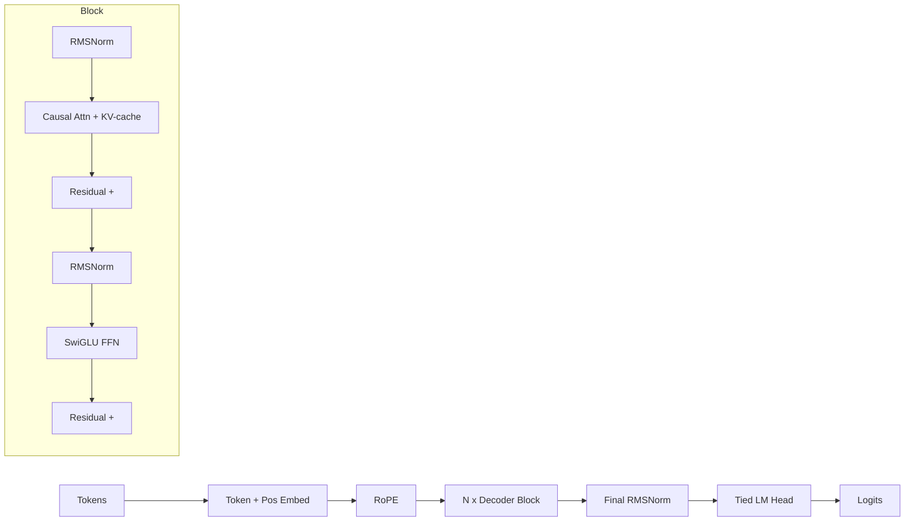

<div align="center">


<a href="https://github.com/Umarfarook1/Nano-LLM-from-scratch">
  
</a>

<br/>

<p>
  
  
  
  
  
</p>

<sub><i>A from-the-ground-up reproduction of GPT-2 124M. The point isn't to beat the original · it's to leave nothing as a black box.</i></sub>

</div>

---

## Why this repo exists

There's a difference between *using* an LLM and *building* one. This repo walks the second path end-to-end: byte-pair tokenizer, transformer blocks (causal attention, RoPE, RMSNorm, SwiGLU), a real pre-training run on FineWeb-edu, downstream evals (HellaSwag / LAMBADA), and a KV-cached inference path. Every choice is documented; every tradeoff is ablated.

> **Status:** scaffolding the training loop. First milestone: hit nanoGPT-parity loss on OpenWebText subset.

## Architecture



## Modern parts

| Component | Choice | Reason |
|---|---|---|
| Attention | Causal multi-head + Flash SDPA + KV-cache | Modern default; cheap inference |
| Position | Rotary (RoPE) | Better length generalization vs. learned/sin |
| Norm | RMSNorm (pre-norm) | Llama-style; cheaper, more stable |
| FFN | SwiGLU | Llama-style; better quality at same params |
| Tokenizer | BPE (tiktoken-compatible) | Reproducibility + speed |
| Optimizer | AdamW + cosine + warmup | Standard, well-understood |
| Mixed precision | bf16 + grad-clip | Numerically friendly on H100 |

## Quickstart <sub><i>(coming soon)</i></sub>

```bash
# pretrain (single GPU)
uv run train.py --config configs/124m.yaml

# pretrain (8-GPU FSDP)
torchrun --nproc_per_node=8 train.py --config configs/124m.yaml --fsdp

# sample
uv run sample.py --ckpt out/124m/last.pt --prompt "The thing about transformers is"

# eval
uv run eval.py --ckpt out/124m/last.pt --tasks hellaswag,lambada
```

## Eval table <sub><i>(populated as runs complete)</i></sub>

| Model | Params | Tokens | HellaSwag (acc) | LAMBADA (ppl) | Notes |
|---|---|---|---|---|---|
| GPT-2 124M (OpenAI) | 124M | ~10B | 0.289 | 35.1 | reference |
| nanoGPT 124M | 124M | ~10B | 0.296 | · | community baseline |
| **this repo** | 124M | TBD | TBD | TBD | first run |

## Cost receipts <sub><i>(in dollars, no hand-waving)</i></sub>

| Stage | Hardware | Wall-clock | Tokens | $ |
|---|---|---|---|---|
| Pretrain 124M | TBD | TBD | TBD | TBD |
| Eval suite | TBD | TBD | · | TBD |

## Roadmap

- [ ] Tokenizer + data pipeline (FineWeb-edu sharded)
- [ ] Single-GPU training loop hitting nanoGPT-parity loss
- [ ] RoPE + RMSNorm + SwiGLU swap-in with ablation table
- [ ] FSDP / multi-GPU training run
- [ ] HellaSwag + LAMBADA eval harness
- [ ] KV-cached inference + sampler (greedy, top-k, top-p, temp)
- [ ] Push weights + tokenizer + eval card to Hugging Face Hub
- [ ] Companion blog post: *"What I learned training a 124M model from scratch"*

## Project layout

```
.
├── configs/             # YAML configs per model size
├── data/                # tokenization + sharded streaming
├── nano_llm/
│   ├── model.py         # Transformer (RoPE, RMSNorm, SwiGLU, KV-cache)
│   ├── tokenizer.py     # BPE wrapper
│   ├── train.py         # single + FSDP training
│   ├── eval.py          # HellaSwag / LAMBADA / perplexity
│   └── sample.py        # generation + sampling
├── ablations/           # design-choice experiments
└── notebooks/           # exploratory only
```

## Inspiration & required reading

- [karpathy/nanoGPT](https://github.com/karpathy/nanoGPT) · the canonical clean reference
- [karpathy/build-nanogpt](https://github.com/karpathy/build-nanogpt) · the lecture-companion build
- [karpathy/llm.c](https://github.com/karpathy/llm.c) · when you want to remove every abstraction
- [rasbt/LLMs-from-scratch](https://github.com/rasbt/LLMs-from-scratch) · Sebastian Raschka's textbook companion
- [karpathy/nanochat](https://github.com/karpathy/nanochat) · pretrain → SFT → RLHF → serve in one repo

---

<div align="center">

</div>
